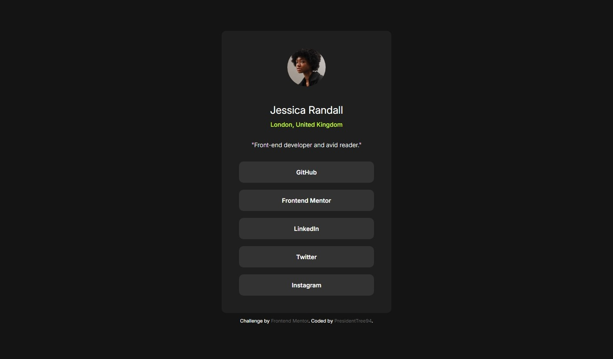

# Frontend Mentor - Social links profile solution

This is a solution to the [Social links profile challenge on Frontend Mentor](https://www.frontendmentor.io/challenges/social-links-profile-UG32l9m6dQ). Frontend Mentor challenges help you improve your coding skills by building realistic projects. 

## Overview

As part of the [Getting started on Frontend Mentor](https://www.frontendmentor.io/learning-paths) learning pathway, it is the third of four challenges users must complete to finish the unit.

### Screenshot

### Links

- Solution URL: [Add solution URL here](https://your-solution-url.com)
- Live Site URL: [Add live site URL here](https://your-live-site-url.com)

## Author

- GitHub Profile: [PresidentTree94](https://github.com/PresidentTree94)
- Frontend Mentor Profile: [PresidentTree94](https://www.frontendmentor.io/profile/PresidentTree94)
- CodePen Profile: [PresidentTree94](https://codepen.io/PresidentTree94)